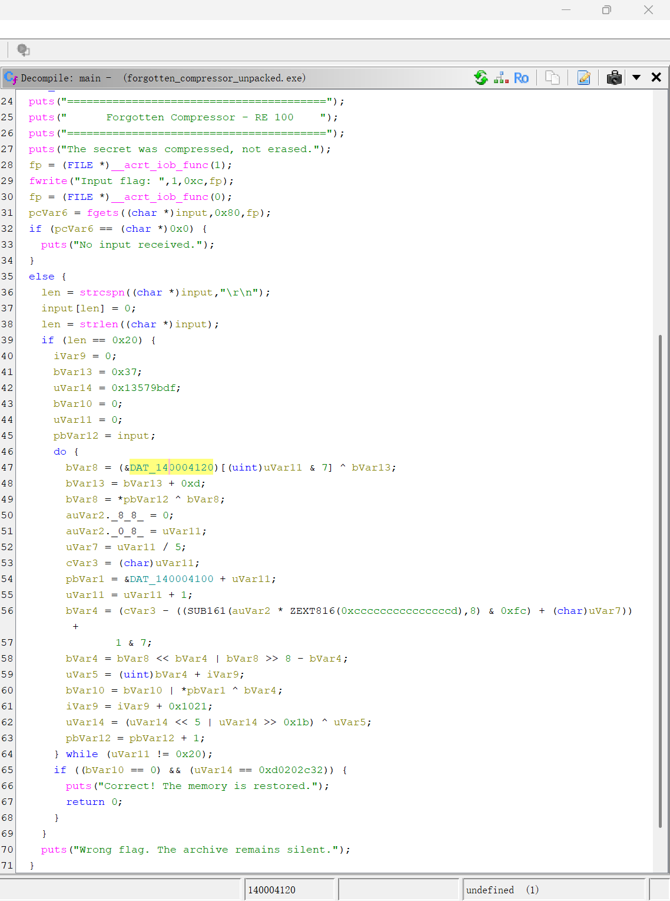
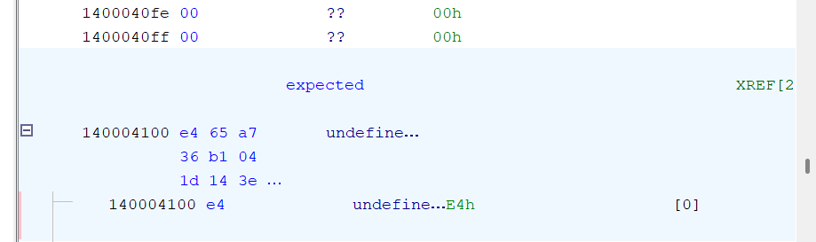

# Forgotten Compressor

> 比赛：`self-practice`
>
> 分类：`reverse`
>
> 难度：`easy`
>
> 完成日期：`2026-09-02`
>
> 验证状态：`静态还原 + 打包/脱壳样本双重动态验证`

## 题目信息

题目提供一个 Windows x64 控制台程序 `forgotten_compressor.exe`。程序提示重要口令被“压缩”而不是删除，要求找出正确的 `flag{...}`。

附件没有随 WP 上传，只记录必要的样本身份：

| 项目 | 打包样本 | 脱壳样本 |
| --- | ---: | ---: |
| 文件大小 | 10752 bytes | 15360 bytes |
| SHA-256 | `2047051cd06debfc103aebd23a879d9dcf7b6510df212718d94f1c52f44f39d6` | `a037795e3aa88b6fbeb0c6b3c1d63f1b9fcf6a172629ebfc1a08acc0f24217c6` |
| 架构 | x86-64 | x86-64 |

使用的主要工具是 ReverseHelper v0.1.0、UPX、Ghidra 和 Python。

## 黑盒测试

先运行程序，不急着做静态分析。分别输入普通字符串、伪 flag 和 40 个相同字符，结果都进入相同失败分支：

```text
========================================
      Forgotten Compressor - RE 100
========================================
The secret was compressed, not erased.
Input flag: Wrong flag. The archive remains silent.
```

黑盒阶段可以确认：程序从标准输入读取一行文本，存在明确的成功/失败判定，但失败信息没有直接泄露长度或逐字节进度。

## ReverseHelper 初筛

先做快速结构检查：

```powershell
reversehelper .\forgotten_compressor.exe --quick
```

关键结果为：

| 项目 | 结果 |
| --- | --- |
| PE 类型 | EXE / x86-64 |
| EntryPoint | RVA `0xC640` / VA `0x14000C640` |
| 节区数量 | 3 |
| Imports / Exports | 12 / 0 |
| Packing verdict | `likely-packed` |
| Structural risk | `6.6/10 HIGH` |

再单独运行异常/查壳模块：

```powershell
reversehelper .\forgotten_compressor.exe --only anomaly
```

工具给出 `likely-packed`、置信度 `10.0/10`，并直接提示可能的壳是 UPX。支撑结论的证据包括：

- 节名 `UPX0`、`UPX1`、`UPX2` 命中已知 UPX 特征；
- `UPX0` 只有虚拟大小而没有对应原始数据，符合运行时展开区的形态；
- `UPX0`、`UPX1` 同时可读、可写、可执行；
- `UPX1` 熵为 `7.529`，接近压缩数据；
- 入口点位于高熵的 `UPX1`，说明当前入口更像解压桩而不是原程序入口。

单个特征可能误报，但节名、权限、熵和入口位置同时吻合，足以把“UPX 标准壳”作为下一步工作假设。

## UPX 脱壳

先让 UPX 检查文件，再保留原文件并对副本脱壳：

```powershell
upx -t .\forgotten_compressor.exe
Copy-Item .\forgotten_compressor.exe .\forgotten_compressor_unpacked.exe
upx -d .\forgotten_compressor_unpacked.exe
```

`upx -t` 返回 `[OK]`，`upx -d` 将文件从 10752 bytes 恢复到 15360 bytes。对脱壳文件重新初筛：

```powershell
reversehelper .\forgotten_compressor_unpacked.exe --quick
reversehelper .\forgotten_compressor_unpacked.exe --only anomaly
```

结果发生明显变化：

| 项目 | 打包前 | 脱壳后 |
| --- | ---: | ---: |
| EntryPoint RVA | `0xC640` | `0x13F0` |
| 节区数量 | 3 | 9 |
| 导入数量 | 12 | 43 |
| 查壳结论 | `likely-packed` | `no-obvious-indicators` |
| 结构风险 | `6.6/10 HIGH` | `0.5/10 LOW` |

这说明标准 UPX 脱壳成功，后续分析应基于 `forgotten_compressor_unpacked.exe`。

## 字符串、导入与候选位置

脱壳后提取字符串：

```powershell
reversehelper .\forgotten_compressor_unpacked.exe --only strings
```

关键字符串集中在 `.rdata`：

```text
The secret was compressed, not erased.
Input flag:
No input received.
Correct! The memory is restored.
Wrong flag. The archive remains silent.
```

导入模块恢复出 `fgets`、`strcspn`、`strlen`、`strncmp` 等函数：

```powershell
reversehelper .\forgotten_compressor_unpacked.exe --only imports
reversehelper .\forgotten_compressor_unpacked.exe --only validation
```

Validation 模块给出两个重要线索：

```text
RVA 0x2224  Comparator Call Site: strncmp
RVA 0x289D  Input Candidate: fgets call site
```

这些结果适合导航，不应直接等同于最终校验。`strncmp` 也可能来自运行库代码；真正决定成功分支的是 `main` 中的自定义 32 轮循环。Targets 模块列出的许多间接 CALL/JMP 同样包含 CRT 启动代码产生的噪声，需要结合字符串 XREF 和局部反编译筛选。

## Ghidra 定位主校验

在 Ghidra 中从成功、失败字符串查看交叉引用，可以定位到读取输入和校验的 `main`。核心区域如下：



首先可以直接恢复输入约束：

```c
fgets(input, 0x80, stdin);
input[strcspn(input, "\r\n")] = 0;

if (strlen(input) == 0x20) {
    // 32轮校验
}
```

因此输入长度必须为 `0x20`，即 32 字节。

循环访问两个常量区域：

```c
(&DAT_140004120)[i & 7]
&DAT_140004100 + i
```

两者不能都按循环次数理解成 32 字节：

- `DAT_140004120[i & 7]` 的下标只有 0～7，是循环使用的 8 字节 key；
- `DAT_140004100[i]` 依次读取偏移 0～31，是 32 字节 expected 表。

把 `DAT_140004100` 定义成 `byte[32]` 后，可以在 Listing 或 Bytes 窗口展开并复制：



得到：

```text
expected[32] =
e4 65 a7 36 b1 04 1d 14 3e 96 1c 0f 01 08 65 9b
05 58 68 c0 bf dc 9c 36 64 c6 48 f7 e0 b1 72 7f

key[8] =
23 71 c4 5a 9d 0f b2 68
```

## 化简循环移位次数

Ghidra 对移位次数的反编译包含：

```c
SUB161(auVar2 * ZEXT816(0xCCCCCCCCCCCCCCCD), 8)
```

这里不能只看到 `0xCCCC...CCCD` 就断言是“除以 10”。必须结合 128 位乘积、截取位置、掩码以及附近已经出现的 `i / 5` 一起分析。

令：

```text
i = 5q + r，0 <= r < 5
q = i / 5
```

在本题 `i = 0..31` 的范围内，宽乘积高部的相关低字节对应 `floor(4i/5)`。经过 `& 0xFC` 后留下 `4q`，再加反编译中已有的 `q`，复杂项等于 `5q`。于是：

```text
i - 5q + 1
= i % 5 + 1
```

末尾的 `& 7` 对实际产生的 1～5 不改变结果，只是把移位数限制在 8 位循环移位范围。

## 还原校验算法

将临时变量按用途重命名后，32 轮校验可以整理成：

```c
uint8_t diff = 0;
uint32_t state = 0x13579BDF;

for (unsigned i = 0; i < 32; i++) {
    uint8_t mask = (uint8_t)(0x37 + 13 * i);
    uint8_t mixed = input[i] ^ key[i & 7] ^ mask;
    uint8_t encoded = rol8(mixed, i % 5 + 1);

    diff |= expected[i] ^ encoded;
    state = rol32(state, 5) ^ (encoded + i * 0x1021);
}

return diff == 0 && state == 0xD0202C32;
```

`diff` 使用 OR 累积每轮 XOR 差异。任何一轮出现非零差异后都不会被后续轮次抵消，因此 `diff == 0` 等价于：

```text
encoded[i] == expected[i]，对所有 i 都成立
```

逐字节变换是可逆的：正向最后一步是 `ROL8`，逆向先执行 `ROR8`；XOR 的逆运算仍是 XOR：

```text
input[i] = ROR8(expected[i], i % 5 + 1)
           XOR key[i & 7]
           XOR ((0x37 + 13*i) & 0xFF)
```

state 不参与输入字节的恢复，它是第二条完整性检查。恢复候选后再正向重算 state 即可。

## Python 解题脚本

```python
expected = bytes.fromhex(
    "e4 65 a7 36 b1 04 1d 14 "
    "3e 96 1c 0f 01 08 65 9b "
    "05 58 68 c0 bf dc 9c 36 "
    "64 c6 48 f7 e0 b1 72 7f"
)

key = bytes.fromhex("23 71 c4 5a 9d 0f b2 68")


def rol(x, n, bits):
    n %= bits
    mask = (1 << bits) - 1
    x &= mask
    return ((x << n) | (x >> (bits - n))) & mask


def ror(x, n, bits):
    n %= bits
    mask = (1 << bits) - 1
    x &= mask
    return ((x >> n) | (x << (bits - n))) & mask


assert len(expected) == 32
assert len(key) == 8

# 逆向恢复输入
candidate = bytearray()

for i, encoded in enumerate(expected):
    rotation = i % 5 + 1
    round_mask = (0x37 + 13 * i) & 0xFF
    mixed = ror(encoded, rotation, 8)
    candidate.append(mixed ^ key[i & 7] ^ round_mask)

candidate = bytes(candidate)

# 正向复现原校验
diff = 0
state = 0x13579BDF

for i, input_byte in enumerate(candidate):
    rotation = i % 5 + 1
    round_mask = (0x37 + 13 * i) & 0xFF
    mixed = input_byte ^ key[i & 7] ^ round_mask
    encoded = rol(mixed, rotation, 8)

    diff |= encoded ^ expected[i]
    state = (
        rol(state, 5, 32)
        ^ ((encoded + i * 0x1021) & 0xFFFFFFFF)
    ) & 0xFFFFFFFF

assert diff == 0
assert state == 0xD0202C32

print(candidate.decode("ascii"))
```

脚本输出：

```text
flag{upx_is_not_encryption_2026}
```

## 动态验证

将脚本输出分别输入打包样本和脱壳样本，两者都返回：

```text
Correct! The memory is restored.
```

两个进程的退出码均为 `0`。这同时证明：

- UPX 脱壳没有改变原程序语义；
- expected/key 提取范围正确；
- 8 位旋转、byte 截断和 32 位 state 更新均已正确复现。

## 踩坑与修正

### 把所有数组都判断成 32 字节

循环执行 32 次不等于每个表都有 32 项。应根据实际下标范围判断：`i` 访问 32 项，`i & 7` 只访问 8 项。

### 把魔数固定解释为除以 10

常量乘法必须和后续取高位、移位、掩码及 signedness 一起分析。本题的最终语义是 `i % 5 + 1`，不是十进制位拆分。

### 倒序恢复全部输入

state 的逆递推确实需要按 31 到 0 处理，但每个输入字节已经由 `expected[i]` 独立确定。把两者混在一个倒序循环中会先得到逆序字符串，还容易漏掉 `i = 0`。更清晰的做法是正序恢复 candidate，再独立做 state 验证。

### 忘记模拟固定位宽

Python 整数不会自动按 8 位或 32 位溢出。round mask、旋转结果和 state 都应显式使用 `& 0xFF` 或 `& 0xFFFFFFFF` 截断。

### 把 ReverseHelper 候选当成最终结论

自动工具能快速发现壳、危险节区、输入 API 和比较候选，但 CRT 代码中的 `strncmp`、间接 CALL/JMP 也会产生噪声。最终仍需依靠字符串 XREF、局部反编译、数组访问范围和原程序运行结果形成证据闭环。

## 关键结论

- 黑盒测试应位于静态工具之前，用来建立输入和分支行为基线。
- UPX 标准壳可通过节名、熵、权限、入口点以及 `upx -t` 交叉确认。
- 脱壳后重新运行同一组分析，可以用结构变化判断脱壳是否成功。
- 反编译器临时变量需要按数据流重命名，复杂数学表达式需要结合汇编和取值范围化简。
- 循环次数、数组访问范围和原始对象声明是三个不同概念。
- 求解脚本必须包含正向验证，并最终交回原程序确认。

这道题的题眼也与标题一致：UPX 只是可执行文件压缩壳，不是加密算法。先脱掉外壳，真正的校验逻辑仍然需要正常逆向。
