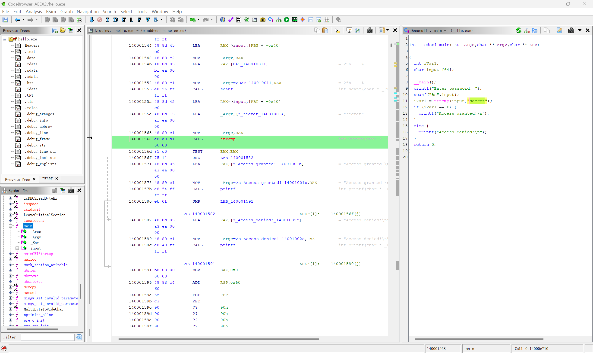

# hello.exe：从失败提示定位明文字符串校验

> 来源：self-practice
>
> 分类：Windows x64 Reverse
>
> 难度：easy
>
> 完成日期：2026-09-04
>
> 验证状态：Ghidra 静态分析 + 原程序运行验证

## 题目信息

目标是找出 `hello.exe` 接受的密码。最初用短数字和一组较长的字母测试，程序都只输出 `Access denied!`，黑盒结果没有暴露校验规则，因此转入 Ghidra 静态分析。

| 项目 | 记录 |
| --- | --- |
| 文件名 | `hello.exe` |
| 文件大小 | 399817 bytes |
| SHA-256 | `AFD242F5FE7F0D8BB6323D812E411763D402FB25C0CBDB5DCACCF4E188950D7F` |
| 格式与架构 | PE32+ / AMD64 / Windows 控制台程序 |
| ImageBase | `0x140000000` |

仓库只保存分析记录和不含个人路径的静态分析截图，不重新分发可执行文件。

## 黑盒测试的边界

两次失败测试都得到：

```text
Enter password: <input>
Access denied!
```

这只能证明两个候选值没有通过校验。第二次输入虽然较长，但仍不足以判断程序是否做了长度检查；没有崩溃也不能证明输入处理安全。失败输出没有随内容变化，继续随机猜测得到的信息有限。

## 从失败提示进入 main

在 Ghidra 的 Defined Strings 中找到 `Access denied!`，沿交叉引用进入 `main`。反编译窗口恢复出了完整主流程：



整理后的等价伪代码如下。它用于说明指令行为，不是提取出的原始源码：

```c
int main(void)
{
    char input[64];

    printf("Enter password: ");
    scanf("%s", input);

    if (strcmp(input, "secret") == 0)
        printf("Access granted!\n");
    else
        printf("Access denied!\n");

    return 0;
}
```

`strcmp` 在两个字符串完全相同时返回 `0`。因此反编译结果中的 `iVar1 == 0` 对应成功分支。

## 用汇编确认分支

截图中的关键指令为：

```asm
14000155a  LEA   RAX, [RBP-0x40]       ; input
14000155e  LEA   RDX, ["secret"]       ; 第二个参数
140001565  MOV   RCX, RAX              ; 第一个参数 input
140001568  CALL  strcmp
14000156d  TEST  EAX, EAX
14000156f  JNZ   0x140001582           ; 不相等时跳到失败分支
```

Windows x64 调用中，前两个指针参数通过 `RCX`、`RDX` 传递。这里 `RCX` 指向用户输入，`RDX` 指向常量字符串。调用返回后，`TEST EAX,EAX` 检查返回值：

- `EAX == 0` 时 ZF=1，`JNZ` 不跳转，随后输出 `Access granted!`；
- `EAX != 0` 时 ZF=0，`JNZ` 跳到 `0x140001582`，输出 `Access denied!`。

静态数据流和反编译结果相互吻合，因此候选密码就是参与比较的明文字符串。

## 原程序验证

把候选值输入原程序，实际观察到：

```text
Enter password: secret
Access granted!
```

成功分支可以正常到达，说明静态还原正确。本次不需要修改程序、强制改变跳转或编写求解脚本。

## 额外发现：输入长度没有限制

`input` 只有 64 字节，而 `scanf("%s", input)` 没有限制读取宽度。为了容纳结尾的 `\0`，安全输入长度最多应为 63 字节；更长的非空白输入可能写出数组边界。之前的“长字符串”仍短于这个界限，所以没有出现可见异常并不矛盾。

实际程序应至少改为：

```c
scanf("%63s", input);
```

并检查 `scanf` 的返回值。静态代码可以确认越界写入风险，但本次没有通过崩溃或控制流覆盖验证可利用性。

## 复盘

这类小型 Crackme 可以从成功、失败提示的交叉引用切入，再确认比较函数的参数来源和返回值语义。黑盒输入应围绕明确假设设计：测试一个 40 多字节的字符串不足以验证 64 字节缓冲区的边界；静态发现固定大小数组和无宽度 `%s` 后，才能知道真正需要验证的长度范围。
