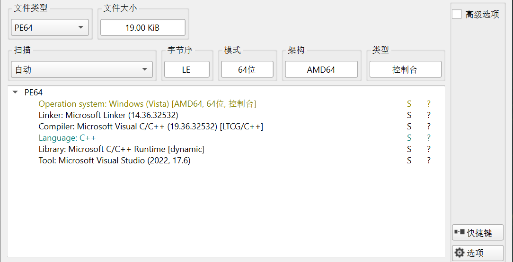
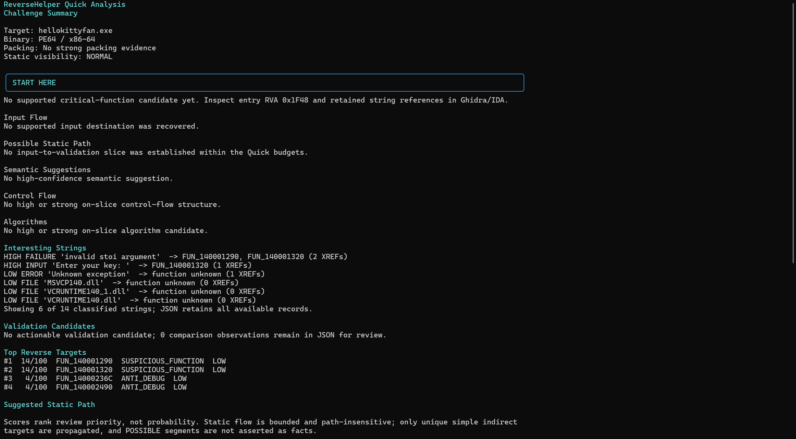
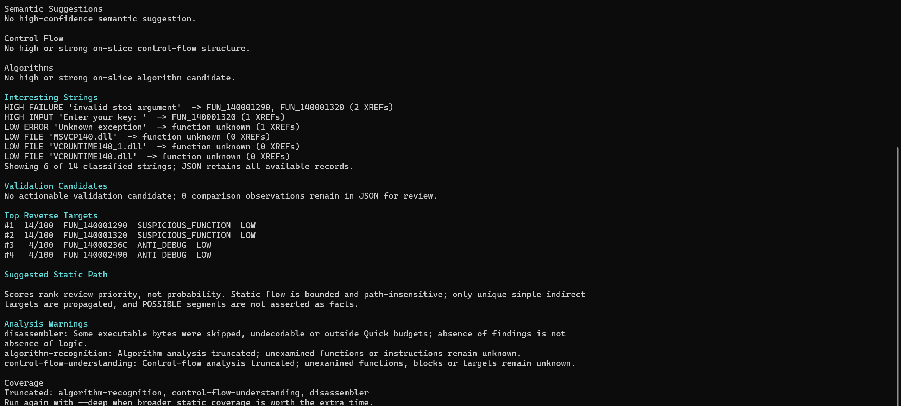
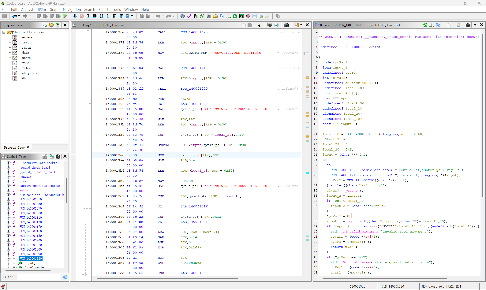
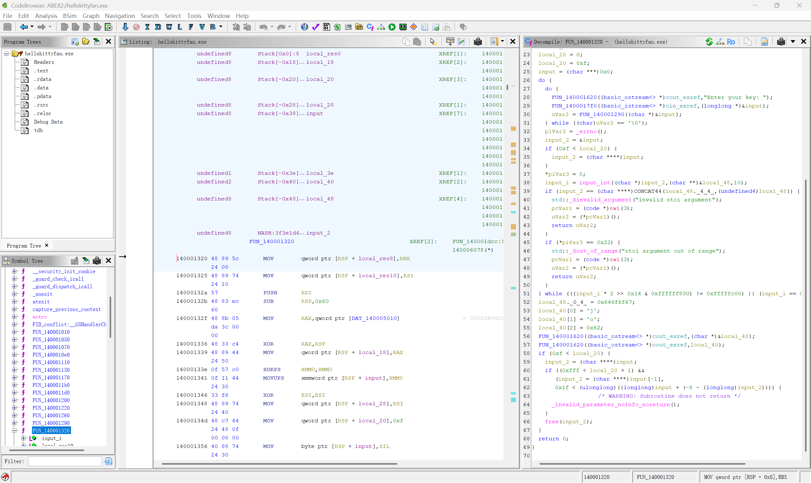
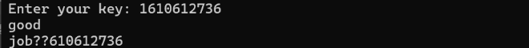

# hellokittyfan's crackme：从整数位运算反推有效 key

> 来源：self-practice（Crackme 练习）
>
> 分类：Windows x64 Reverse
>
> 难度：easy（个人评估）
>
> 完成日期：2026-09-08
>
> 验证状态：Ghidra 静态分析 + 求解脚本边界检查 + 原程序运行验证

## 题目信息

目标是找出 `hellokittyfan.exe` 接受的 key。程序读取十进制整数，用乘法、算术右移和掩码判断是否进入成功分支。最终求得一个有效输入 `1610612736`，代入原程序后输出了 `good` 和 `job`。

Detect It Easy 的结果显示，样本是 19.00 KiB 的 PE64 / AMD64 Windows 控制台程序，识别到 Microsoft Visual C/C++、C++ 运行库和 Visual Studio 2022 工具链。



## 从提示字符串定位主逻辑

先用 ReverseHelper 做快速分析。结果没有强烈的加壳迹象，但也没有自动恢复出完整的输入到校验路径。它提供了两个值得跟进的字符串引用：

```text
"Enter your key: "        -> FUN_140001320
"invalid stoi argument"  -> FUN_140001290, FUN_140001320
```



快速分析报告同时提示覆盖范围有限。这里的函数排名只是人工复核的入口，不能把报告里的 `ANTI_DEBUG LOW` 标签直接当作存在自定义反调试的证据。



根据这些线索，在 Ghidra 中进入 `FUN_140001320`。它包含输入提示、`cin` 读取、整数转换、循环判断和成功输出，因此把它作为 main 的主要逻辑来分析。



## 先区分字符串处理和真正的校验

反编译结果中出现了 `char ***`、`char ****` 以及容量与 `0xF` 的比较。这些类型容易干扰阅读，结合布局可以把它们理解为 MSVC `std::string` 的短字符串优化：容量不超过 15 时，字符放在对象内部；更长时，通过对象中的指针访问堆内存。

`FUN_140001290` 会先尝试做十进制整数转换，检查没有读到数字和超出范围这两类错误。正常返回时，返回值的低字节固定为 `1`，而调用方只检查这个低字节。因此它没有额外限制 key 的数值；转换失败走的是异常路径，不能理解为返回 `false` 后继续输入。

调用方随后又进行一次整数转换，真正的判断集中在：

```c
((lVar2 * 2 >> 0x14) & 0xffffff80U) == 0xfffffc00
    && lVar2 != 0
```



## 用汇编确认 32 位运算

虽然程序是 x64，但 Windows 下的 `long` 仍然是 32 位。截图中的关键指令也直接确认了运算宽度：

```asm
1400013d6  LEA  ECX, [RAX + RAX]
1400013d9  SAR  ECX, 0x14
1400013dc  AND  ECX, 0xffffff80
1400013df  XOR  ECX, 0x269a
1400013e5  NOT  ECX
1400013e7  CMP  ECX, 0x2565
1400013ed  JNZ  0x140001360
```

`LEA` 把两倍输入的低 32 位写入 `ECX`；`SAR ECX, 0x14` 是算术右移 20 位，会保留符号。设掩码后的结果为 `y`，后面三条指令要求：

```text
~(y XOR 0x269A) == 0x00002565
y == (~0x00002565 XOR 0x0000269A) & 0xFFFFFFFF
y == 0xFFFFFC00
```

这与反编译出的条件一致。求解时必须模拟这套机器指令行为，不能直接照搬成依赖有符号溢出的 C 表达式，也不能使用 Python 的无限精度乘法而不截断。

## 反推输入范围

`0xFFFFFF80` 会清除最低 7 位。因此右移后的结果只要落在以下范围，掩码结果就相同：

```text
0xFFFFFC00 .. 0xFFFFFC7F
即 -1024 .. -897
```

再反推算术右移前的 32 位有符号结果：

```text
-1073741824 .. -939524097
```

这个结果来自输入乘 2 后保留低 32 位。考虑乘法的偶数性以及正数输入发生截断的分支，可得到两个闭区间：

```text
-536870912 .. -469762049
1610612736 .. 1677721599
```

所以有效 key 不唯一。选择正数区间的下界 `1610612736`，计算过程是：

```text
输入整数             1610612736 = 0x60000000
乘 2，保留低 32 位                0xC0000000
算术右移 20 位                   0xFFFFFC00
与 0xFFFFFF80                    0xFFFFFC00
```

## 求解脚本

完整脚本见 [solve.py](solve.py)，只使用 Python 标准功能，无需安装第三方库。它直接反推范围，不需要暴力枚举，也不会运行或修改题目程序。

核心是先恢复 32 位有符号数，再进行算术右移：

```python
def signed32(value):
    value &= 0xFFFFFFFF
    return value if value < 0x80000000 else value - 0x100000000


def accepts(value):
    if not -(1 << 31) <= value < (1 << 31):
        return False
    doubled = signed32(value * 2)
    return value != 0 and ((doubled >> 20) & 0xFFFFFF80) == 0xFFFFFC00
```

在本题目录运行：

```powershell
py .\solve.py
```

关键输出为：

```text
Key: 1610612736
Accepted integer ranges (inclusive):
  -536870912 .. -469762049
  1610612736 .. 1677721599
32-bit doubled: 0xC0000000
After SAR 20:   0xFFFFFC00
```

脚本检查了两个区间的上下界、中间值、紧邻区间外的值，以及零和超出 32 位整数范围的值。这些检查验证的是算术模型；原程序中实际验证的输入是下面的 `1610612736`，并未逐个运行所有候选值。

## 原程序验证

运行题目程序，输入脚本给出的 key：

```powershell
.\hellokittyfan.exe
```



程序输出 `good`，下一行以 `job` 开头并带有多余字符，随后返回终端提示符。这证明该 key 到达了成功分支。

`job` 后的异常输出与反编译中未显式写入字符串结束符的现象一致：代码只设置了 `j`、`o`、`b` 三个字符，按 C 字符串输出时可能继续读取相邻内存，而后面恰好邻接输入字符串对象。这里可以判断存在字符串终止方面的疑点，但没有做逐字节内存跟踪，不能断言每个多余字符的具体来源。

## 复盘

这题的关键是把 C++ 字符串和异常处理代码剥离开，找到真正影响成功分支的整数表达式。ReverseHelper 的字符串引用提供了入口，Ghidra 的 `ECX` 和 `SAR` 指令确认了位宽与移位方式，再用 Python 显式模拟 32 位截断，最后把候选输入交给原程序验证。

不能仅凭 x64 架构把所有整数都当成 64 位，也不能忽略掩码丢弃低位后产生的多解。这里求出的是满足校验的 key，不涉及密文解密。
